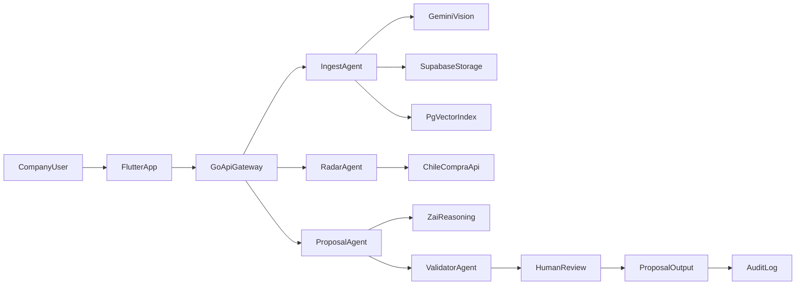

# Nexus RFP - Blueprint Tecnico Operativo para el Agente

## 1) Proposito del documento
Este documento define como construir Nexus RFP de extremo a extremo con foco en:
- velocidad de entrega (MVP),
- confiabilidad en datos criticos (montos, fechas, anexos),
- escalabilidad operativa para PyMEs B2B en Chile.

`rdf.md` sigue siendo el PRD de negocio. Este blueprint lo transforma en instrucciones tecnicas ejecutables para el agente.

## 2) Vision y alcance por capas

### 2.1 Problema a resolver
Las empresas tecnicas pierden oportunidades porque:
- no alcanzan a leer bases extensas,
- tienen informacion historica dispersa y no estructurada,
- producen propuestas tarde y con riesgo de error en campos sensibles.

### 2.2 Alcance recomendado

#### MVP (0-90 dias)
- Ingesta multimodal basica (PDF, imagen, audio).
- Radar de oportunidades desde ChileCompra con scoring inicial.
- Extraccion de requisitos criticos de bases.
- Generacion de borrador de propuesta en Markdown/PDF.
- Validacion humana obligatoria antes de version final.

#### V1 (90-180 dias)
- Reglas de negocio por empresa (margenes, proveedores, estilo).
- Mejora de precision de OCR y extraccion con evaluacion continua.
- Colaboracion multiusuario por empresa (roles).
- Trazabilidad completa de decisiones del sistema.

#### V2 (180+ dias)
- Automatizaciones avanzadas por rubro.
- Forecast de probabilidad de adjudicacion.
- Integraciones ERP/contables.

## 3) Principios de arquitectura
- **Agent-first orchestration:** cada tarea compleja se divide en agentes especializados.
- **Human-in-the-loop:** los campos de alto riesgo nunca se publican sin revision humana.
- **Event-driven y asincrono cuando aplique:** workloads de IA y OCR fuera del request sincrono.
- **Observabilidad desde el dia 1:** trazas, logs estructurados y metricas por agente.
- **Cost-aware AI:** presupuesto por cliente y estrategia de fallback por proveedor/modelo.

## 4) Arquitectura end-to-end

### 4.1 Stack base
- Frontend: Flutter (mobile-first, web companion).
- Backend: Go (API + orquestacion + workers).
- Datos: Supabase (Postgres, Auth, Storage, pgvector).
- IA razonamiento: Z.ai.
- IA vision/OCR: Gemini Flash.
- Infra: Hetzner para servicios Go; Supabase administrado.

### 4.2 Diagrama de flujo principal

### 4.3 Flujo operativo de punta a punta
1. Usuario sube documentos o audio a Boveda.
2. IngestAgent normaliza, clasifica, extrae texto y metadatos.
3. Se almacenan archivo bruto, representacion estructurada y embeddings.
4. RadarAgent sincroniza oportunidades y calcula score de match.
5. Usuario selecciona licitacion objetivo.
6. ProposalAgent combina bases + historial de empresa + reglas de negocio.
7. ValidatorAgent marca incertidumbres y campos criticos.
8. Usuario valida y corrige.
9. Se emite propuesta final y se registra auditoria.

## 5) Agentes y contratos de responsabilidad

### 5.1 RadarAgent
- **Entrada:** filtros por empresa, historial, regiones, rubros.
- **Salida:** lista de licitaciones con score, motivos y urgencia.
- **SLO interno:** actualizacion horaria y latencia de scoring menor a 60 segundos por lote.

### 5.2 IngestAgent
- **Entrada:** archivos PDF/imagen/audio.
- **Salida:** texto extraido, clasificacion documental, metadatos y embedding.
- **Regla:** idempotencia por hash de contenido para evitar duplicados y costo extra.

### 5.3 ProposalAgent
- **Entrada:** licitacion objetivo + contexto de empresa + datos recuperados (RAG).
- **Salida:** borrador estructurado en secciones (tecnica, comercial, cumplimiento).
- **Regla:** no inventar datos ausentes; declarar incertidumbre explicitamente.

### 5.4 ValidatorAgent
- **Entrada:** borrador y entidades criticas detectadas.
- **Salida:** checklist de verificacion, flags de riesgo, recomendaciones de correccion.
- **Regla:** bloquea publicacion si hay incertidumbre en campos bloqueantes.

## 6) Modelo de datos minimo viable

### 6.1 Entidades base
- `companies`: perfil, rubro, configuraciones IA, plan.
- `users`: identidad, rol, company_id.
- `vault_items`: tipo documento, hash, ubicacion storage, estado procesamiento.
- `vault_chunks`: texto chunked, embedding, metadata chunk.
- `tenders`: datos de ChileCompra y estado interno.
- `tender_requirements`: requisitos extraidos (fechas, boletas, anexos, montos).
- `proposals`: versiones de propuesta, estado, responsable validacion.
- `proposal_evidence`: fuentes usadas por seccion para trazabilidad.
- `audit_events`: eventos de seguridad y cambios relevantes.

### 6.2 Reglas de datos
- Multi-tenant estricto por `company_id`.
- Soft-delete para documentos, hard-delete diferido por politica de retencion.
- Historial de versionado en `proposals` para rollback humano.

## 7) Contratos de API (Go) iniciales

### 7.1 Endpoints de Radar
- `GET /v1/tenders/sync` -> dispara sincronizacion incremental.
- `GET /v1/tenders` -> lista licitaciones filtrables.
- `GET /v1/tenders/{id}/score` -> detalle de score y explicacion.

### 7.2 Endpoints de Boveda
- `POST /v1/vault/upload` -> URL firmada + metadata.
- `POST /v1/vault/process` -> inicia pipeline de OCR/extraccion.
- `GET /v1/vault/items` -> lista y estado.

### 7.3 Endpoints de Propuestas
- `POST /v1/proposals/draft` -> genera borrador.
- `POST /v1/proposals/{id}/validate` -> ejecuta validaciones.
- `POST /v1/proposals/{id}/approve` -> cierre humano.
- `GET /v1/proposals/{id}/export` -> descarga Markdown/PDF.

## 8) Roadmap de implementacion recomendado

### Fase 0 - Fundaciones (semana 1-2)
- Estructura de repo, convenciones, CI, ambientes.
- Supabase schema inicial y RLS multi-tenant.
- Skeleton API Go con autenticacion.

**Definition of Done**
- Autenticacion operativa con roles basicos.
- Migraciones versionadas y reproducibles.
- Pipeline CI ejecuta tests y lint.

### Fase 1 - Boveda y procesamiento (semana 3-5)
- Carga de archivos y pipeline IngestAgent.
- OCR y clasificacion documental inicial.
- Indexacion en pgvector.

**Definition of Done**
- Archivos procesados con trazabilidad completa.
- Busqueda semantica devuelve evidencia util.
- Errores de procesamiento tienen reintento y estado visible.

### Fase 2 - Radar de oportunidades (semana 6-7)
- Integracion ChileCompra.
- Motor de scoring por match empresa-licitacion.
- Alertas push/notificacion.

**Definition of Done**
- Sincronizacion horaria estable.
- Ranking explicable por oportunidad.
- Alertas configurables por empresa.

### Fase 3 - Generador de propuestas (semana 8-10)
- ProposalAgent con plantillas base.
- ValidatorAgent y checklist de riesgo.
- Exportador Markdown/PDF.

**Definition of Done**
- Propuesta de prueba lista en menos de 2 minutos (objetivo).
- Validacion humana obligatoria antes de export final.
- Evidencia por seccion disponible en UI.

### Fase 4 - Hardening y salida controlada (semana 11-12)
- Observabilidad, alertas, dashboards.
- Evaluacion IA continua y ajuste de prompts.
- Seguridad, auditoria y politicas de retencion.

**Definition of Done**
- KPIs instrumentados y monitoreables.
- Runbooks operativos listos.
- Checklist de seguridad completado.

## 9) QA, evaluacion IA y criterios de promocion

### 9.1 Testeo funcional
- API contract tests para endpoints criticos.
- E2E de flujo: ingesta -> propuesta -> aprobacion -> export.
- Pruebas de permisos por rol y tenant.

### 9.2 Evaluacion de IA
- Dataset etiquetado para OCR, extraccion de entidades y calidad de redaccion.
- Medicion semanal de precision por tipo de documento.
- Regression suite de prompts antes de cada despliegue.

### 9.3 Umbrales minimos sugeridos
- OCR campos clave: >= 95%.
- Fechas y montos criticos: >= 97% con validacion cruzada.
- Latencia draft: percentil 95 menor a 120 segundos.

### 9.4 Criterios de bloqueo de release
- Si precision cae bajo umbral en campos criticos.
- Si falla aislamiento multi-tenant.
- Si no hay trazabilidad de evidencia por propuesta.

## 10) Seguridad, cumplimiento y gobierno de datos

### 10.1 Controles minimos
- RLS en todas las tablas multiempresa.
- Cifrado en transito y en reposo.
- Rotacion periodica de secretos.
- Registro de auditoria para eventos sensibles.

### 10.2 Politicas recomendadas
- Retencion configurable por tipo documental.
- Eliminacion segura post-retencion.
- Acceso minimo por rol (RBAC).

### 10.3 Eventos auditables obligatorios
- Carga/eliminacion de documento.
- Cambio de configuracion de empresa.
- Aprobacion final de propuesta.
- Exportacion de propuesta.

## 11) Operacion y control de costos de inferencia

### 11.1 Estrategias de costo
- Cachear resultados por hash de documento y version de pipeline.
- Priorizar modelos livianos para tareas simples.
- Escalar a modelos complejos solo en pasos criticos.
- Aplicar limites de uso por empresa y alertas de consumo.

### 11.2 Resiliencia y fallback
- Retries exponenciales con jitter para proveedores IA.
- Cola asincrona para trabajos pesados.
- Fallback de proveedor/modelo ante timeout o cuota.
- Modo degradado: permitir avance con advertencias cuando no hay IA secundaria.

### 11.3 Observabilidad operativa
- Logs estructurados con `trace_id`, `company_id`, `agent_name`.
- Metricas por agente: latencia, error rate, costo estimado.
- Alertas para picos de error y desviacion de costo.

## 11.4 Setup pasivo (onboarding pagado)
1. Confirmar pago de setup (Stripe/Flow) y activar workflow.
2. Solicitar 5 a 10 propuestas historicas ganadas.
3. Ejecutar extraccion de ADN empresarial (estilo, margenes, reglas recurrentes).
4. Guardar perfil operativo como configuracion dinamica por `company_id`.
5. Validar perfil con usuario responsable antes de habilitar modo automatico.

## 12) Playbook de trabajo para el agente

### 12.1 Forma de ejecutar tareas
1. Tomar una tarea atomica por ciclo.
2. Definir criterio de aceptacion antes de codificar.
3. Implementar con tests minimos asociados.
4. Validar lint/tests/evidencia.
5. Entregar con resumen de cambios y riesgos residuales.

### 12.2 Definition of Done por tipo de tarea

#### Backend
- Endpoint implementado + validaciones + tests.
- Manejo de errores consistente.
- Telemetria y logs incluidos.

#### Frontend
- Estado de carga/error/vacio cubiertos.
- Integracion con API real o mock estable.
- UX movil priorizada.

#### IA/Agentes
- Prompt versionado.
- Evaluacion con dataset de referencia.
- Salida con evidencias y score de confianza.

#### Datos
- Migracion versionada.
- Indices validados.
- Politica de acceso definida.

### 12.3 Evidencia minima exigida en cada entrega
- Lista de archivos tocados.
- Resultado de tests/lint.
- Captura de respuesta o flujo validado.
- Riesgos conocidos y siguiente accion sugerida.

## 13) Riesgos principales y mitigaciones
- **Riesgo:** errores en montos/fechas por OCR.  
  **Mitigacion:** doble validacion (modelo + regla), HITL obligatorio en campos bloqueantes.
- **Riesgo:** costo IA no controlado.  
  **Mitigacion:** cache, limites por tenant, fallback de modelos.
- **Riesgo:** filtracion entre empresas.  
  **Mitigacion:** RLS, pruebas de aislamiento, auditoria continua.
- **Riesgo:** dependencia de proveedores externos.  
  **Mitigacion:** colas, retries, fallback y modo degradado.

## 14) Convenciones para proximas sesiones con el agente
- Indicar siempre objetivo, alcance y criterio de exito.
- Pedir entregas por vertical (Radar, Boveda, Propuestas) para reducir riesgo.
- Exigir evidencia de validacion antes de cerrar hito.
- Mantener backlog priorizado por impacto de negocio.

## 15) Primer backlog sugerido (ejecutable)
1. Definir schema inicial Supabase con RLS.
2. Levantar API Go con autenticacion y salud.
3. Implementar carga de archivos a Boveda.
4. Integrar OCR y clasificacion basica.
5. Guardar embeddings y busqueda semantica simple.
6. Integrar sincronizacion inicial ChileCompra.
7. Construir endpoint de borrador de propuesta.
8. Agregar validacion humana y exportacion.

---

Este documento debe evolucionar por version (`v0`, `v1`, `v2`) y mantenerse sincronizado con decisiones reales de implementacion.
